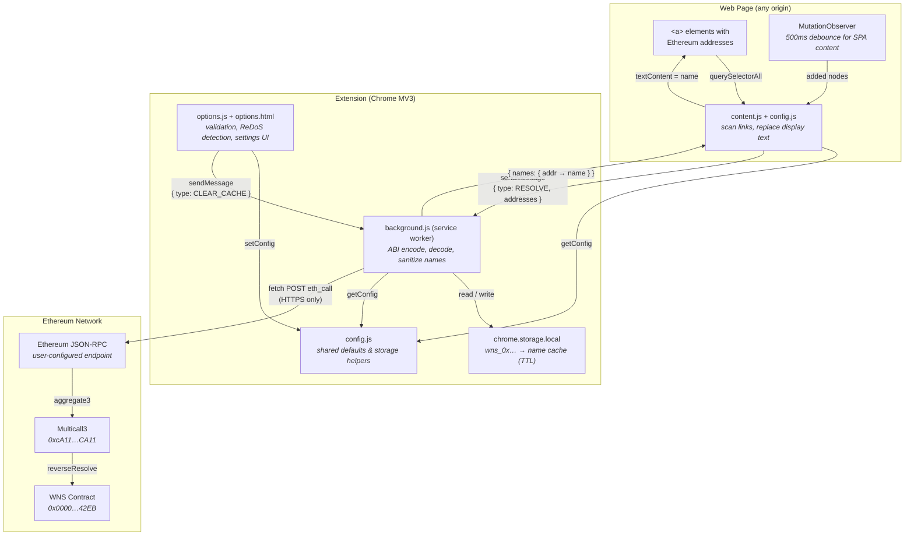

# Security Audit: Wei Name Service (WNS) Resolver - Chrome Extension

| Field              | Value                                                    |
|--------------------|----------------------------------------------------------|
| **Extension**      | Wei Name Service (WNS) Resolver                         |
| **Platform**       | Chrome (Manifest V3)                                     |
| **Version**        | 26.2.18.1003                                             |
| **Audit Date**     | 2026-02-18                                               |
| **Audit Type**     | Self-performed security audit using AI (Claude Opus 4.6) |
| **Auditor**        | Denizen (developer) assisted by Anthropic Claude Opus 4.6 model |

> **Disclaimer:** This is a self-performed audit conducted by the extension's
> developer with the assistance of an AI language model (Claude Opus 4.6 by
> Anthropic). It is not an independent third-party security audit. Findings
> should be treated as a best-effort review, not a certification. Future
> releases will receive per-version, per-platform audits.

---

## 1. Scope

All source files in the `chrome/` directory at version **26.2.18.1003**:

| File               | Lines | Role                                      |
|--------------------|------:|-------------------------------------------|
| `manifest.json`    |    28 | Extension manifest (MV3)                  |
| `background.js`    |   325 | Service worker: RPC calls, caching        |
| `content.js`       |   367 | Content script: DOM scanning, replacement |
| `config.js`        |    44 | Shared configuration defaults & helpers   |
| `options.js`       |   236 | Options page: validation, storage         |
| `options.html`     |   273 | Options page: UI                          |

Also reviewed: `tests/test.html`, `.envrc.local`, `.gitignore`, project `README.md`.

**Out of scope:** Icon assets, third-party smart contract bytecode on-chain.

---

## 2. Architecture Overview



**Key design decisions:**
- Zero external dependencies (no npm, no bundler, no third-party JS)
- All network I/O isolated in the service worker (no CORS from content scripts)
- Content script only modifies `<a>` element text content, never injects HTML
- MutationObserver handles SPA/dynamic content with 500ms debounce

---

## 3. Permissions Analysis

### 3.1 Declared Permissions

```json
{
  "permissions": ["storage"],
  "host_permissions": ["https://*/*"]
}
```

| Permission        | Necessity | Risk    | Notes |
|-------------------|-----------|---------|-------|
| `storage`         | Required  | Low     | Needed for config and name cache |
| `https://*/*`     | Required  | Medium  | Needed to reach arbitrary user-configured RPC endpoints |

### 3.2 Implicit Capabilities

| Capability                     | Present | Notes |
|--------------------------------|---------|-------|
| Content script on all URLs     | Yes     | `<all_urls>` match pattern, `all_frames: true` |
| Execute arbitrary network requests | Yes | Service worker can POST to any HTTPS origin |
| Read page DOM                  | Yes     | Content script reads `<a>` elements |
| Modify page DOM                | Yes     | Replaces text nodes inside `<a>` elements |
| Access tabs/history/cookies    | No      | Not requested |
| Execute remote code            | No      | No `eval`, no remote script loading |
| Clipboard / downloads          | No      | Not requested |

### 3.3 Permissions Assessment

**`https://*/*` (host_permissions):** This broad permission is necessary because
users can configure any Ethereum RPC endpoint. Narrowing to a fixed allowlist
would break the extension's core configurability. The permission is only exercised
by `background.js` for JSON-RPC `eth_call` requests — never for arbitrary
browsing data exfiltration.

**`<all_urls>` (content script matches):** Required because Ethereum addresses
appear on sites across many domains (Etherscan, OpenSea, DeFi apps, forums,
etc.). The content script only reads `<a>` elements and their href/text, and
only modifies text content of matched anchors.

---

## 4. Findings

### FINDING-01: Environment File With API Key in Project Root

| Attribute  | Value              |
|------------|--------------------|
| Severity   | **INFO** (resolved)|
| Category   | Secrets Management |
| File       | `.envrc.local`     |

**Description:** The file `.envrc.local` contains a plaintext Etherscan API key.
This key is not used by the extension itself (the extension uses JSON-RPC, not
the Etherscan API), but it exists in the project root.

**Status:** The repository has never been committed or pushed to a remote. A
`.gitignore` is in place that excludes `.envrc.local` and similar environment
files. The key has not been exposed.

**Recommendation:** No action needed. Continue to ensure `.envrc.local` remains
in `.gitignore` before any future commits.

---

### FINDING-02: Broad Host Permission Surface

| Attribute  | Value      |
|------------|------------|
| Severity   | **LOW**    |
| Category   | Permissions |
| File       | `manifest.json:13-15` |

**Description:** The extension declares `"host_permissions": ["https://*/*"]`,
granting the service worker the ability to make fetch requests to any HTTPS
origin. While this is architecturally necessary (users configure their own RPC
endpoint), it means that any code execution vulnerability in `background.js`
could be leveraged to exfiltrate data to an arbitrary domain.

**Mitigating factors:**
- Manifest V3 prohibits `eval()` and remote code execution.
- The service worker only calls `fetch()` in one code path (`resolveViaRPC`),
  targeting only the user-configured `rpcUrl`.
- No dynamic URL construction from untrusted input reaches `fetch()`.

**Recommendation:** Document this as an accepted risk. Consider adding an
optional domain allowlist in a future version for users who want to restrict
outbound requests.

---

### FINDING-03: Custom Regex Patterns — ReDoS Mitigation is Heuristic

| Attribute  | Value      |
|------------|------------|
| Severity   | **LOW**    |
| Category   | Denial of Service |
| File       | `options.js:35-53` |

**Description:** Users can configure custom regex patterns for address matching
(`ethRe`, `abbrRe`, `hrefRules`). The `detectReDoS()` function uses heuristic
pattern matching to detect catastrophic backtracking:

```javascript
// Nested quantifiers: (x+)+, (x*)+, etc.
if (/(\([^)]*[+*][^)]*\))[+*]|\(\?:[^)]*[+*][^)]*\)[+*]/.test(pattern)) { ... }
// Overlapping alternation with quantifiers: (a|a)+
if (/\([^)]*\|[^)]*\)[+*]/.test(pattern)) { ... }
```

This is a reasonable first-pass check but cannot catch all ReDoS-vulnerable
patterns (e.g., patterns using backreferences, lookaheads with quantifiers, or
deeply nested character classes).

**Mitigating factors:**
- Only the extension user can configure these patterns (self-DoS risk only).
- The patterns run in the content script context, which the browser can kill
  if a tab becomes unresponsive.
- Default patterns are safe and well-tested.

**Recommendation:** Accept as low risk given self-configuration. Optionally add
a timeout wrapper around regex execution in a future version.

---

### FINDING-04: Message Passing Has No Sender Verification

| Attribute  | Value      |
|------------|------------|
| Severity   | **LOW**    |
| Category   | Internal API Security |
| File       | `background.js:290-324` |

**Description:** The `chrome.runtime.onMessage` listener does not verify the
sender of incoming messages:

```javascript
chrome.runtime.onMessage.addListener((message, _sender, sendResponse) => {
```

Any content script context within the extension (including content scripts
running in iframes on any origin) can send `RESOLVE` or `CLEAR_CACHE` messages.

**Mitigating factors:**
- `chrome.runtime.onMessage` is scoped to the extension's own contexts. External
  web pages cannot send messages to the service worker without `externally_connectable`
  being declared (it is not).
- The `RESOLVE` handler strictly validates input addresses against `/^0x[0-9a-fA-F]{40}$/`.
- `CLEAR_CACHE` is a benign operation (worst case: cache is cleared, requiring re-fetch).
- Only the extension's own content scripts and options page can send messages.

**Recommendation:** No action needed. The Chrome runtime message API already
provides sufficient isolation. Optionally log `_sender.tab.url` when debug
logging is enabled.

---

### FINDING-05: Custom RPC Headers Stored in Plaintext

| Attribute  | Value      |
|------------|------------|
| Severity   | **LOW**    |
| Category   | Sensitive Data Storage |
| File       | `options.js:183`, `background.js:206-213` |

**Description:** Custom RPC headers (which may include `Authorization` bearer
tokens or API keys) are stored as a JSON string in `chrome.storage.local` or
`chrome.storage.sync`:

```javascript
const rpcHeaders = JSON.stringify(collectHeaders());
```

These are stored in plaintext and are readable by any code running in the
extension's context.

**Mitigating factors:**
- `chrome.storage.local` is isolated per-extension; other extensions cannot read it.
- `chrome.storage.sync` encrypts data in transit to Google's sync servers.
- This is standard practice for browser extensions; Chrome does not provide
  encrypted storage primitives for extensions.

**Recommendation:** Document in user-facing help that RPC headers are stored
unencrypted locally. Users managing sensitive API keys should be aware.

---

### FINDING-06: `options.html` Uses `innerHTML` for Header Rows

| Attribute  | Value      |
|------------|------------|
| Severity   | **LOW**    |
| Category   | XSS / DOM Injection |
| File       | `options.js:58-61` |

**Description:** The `addHeaderRow` function uses `innerHTML` to construct UI:

```javascript
row.innerHTML =
  '<input type="text" placeholder="Header name" class="header-key">' +
  '<input type="text" placeholder="Value" class="header-value">' +
  '<button type="button" class="remove-header" title="Remove">\u00d7</button>';
```

**Mitigating factors:**
- The HTML string is a static literal — no user input is interpolated.
- The `key` and `value` parameters are set via `.value` property assignment
  (lines 62-63), which does not parse HTML.
- The options page has a CSP: `default-src 'self'; style-src 'self' 'unsafe-inline'`,
  which blocks inline script execution.

**Recommendation:** No action needed. The current usage is safe. For
defense-in-depth, the static HTML could be replaced with `document.createElement`
calls, but this is cosmetic.

---

### FINDING-07: Content Script Modifies DOM Text Without Escaping Concerns

| Attribute  | Value          |
|------------|----------------|
| Severity   | **VERY LOW**   |
| Category   | XSS            |
| File       | `content.js:297-304` |

**Description:** The `replaceAnchor` function writes resolved names into text
nodes:

```javascript
node.textContent = name;
```

**Analysis:** Using `textContent` (not `innerHTML`) is the correct and safe
approach. The `textContent` setter treats the value as plain text, never parsing
it as HTML. Additionally, `background.js:96-102` sanitizes names by stripping:
- C0/C1 control characters (`\u0000-\u001F`, `\u007F-\u009F`)
- Bidi override characters (`\u202A-\u202E`)
- Zero-width characters (`\u200B-\u200F`, `\u2060-\u2069`, `\uFEFF`)
- Truncates to 64 characters maximum

**Recommendation:** No action needed. The current implementation is secure
against XSS and homograph/bidi attacks.

---

### FINDING-08: No Rate Limiting on Address Collection Volume

| Attribute  | Value      |
|------------|------------|
| Severity   | **VERY LOW** |
| Category   | Resource Exhaustion |
| File       | `content.js:234-275` |

**Description:** The `collectEthereumLinks` function scans all `<a>` elements
in a subtree without an upper bound on collection size. A page with thousands of
Ethereum address links would generate a large `RESOLVE` message.

**Mitigating factors:**
- The background worker chunks batches by `maxBatchSize` (default 50, max 500).
- RPC cooldown (default 2000ms) throttles network requests.
- This is a content script running in the page's process — the browser's own
  resource limits apply.
- Such pages (thousands of address links) are rare edge cases.

**Recommendation:** Optionally cap the address set size in a future version
(e.g., process first 500 unique addresses per page load).

---

## 5. Positive Security Findings

The following security-relevant design decisions are **commendable**:

### 5.1 Zero Dependencies
The extension has no `node_modules`, no bundler, and no third-party JavaScript.
This eliminates supply-chain attack surface entirely.

### 5.2 Name Sanitization
`background.js:96-102` strips dangerous Unicode characters before names reach
the DOM, preventing bidi/homograph spoofing attacks:
```javascript
const cleaned = name.replace(
  /[\u0000-\u001F\u007F-\u009F\u200B-\u200F\u202A-\u202E\u2060-\u2069\uFEFF]/g, ''
);
```

### 5.3 Text-Only DOM Modification
The content script exclusively uses `textContent` assignment — never `innerHTML`,
`insertAdjacentHTML`, or `document.write`. This makes XSS through resolved names
impossible.

### 5.4 Strict Address Validation
The message handler validates every address against `/^0x[0-9a-fA-F]{40}$/`
before passing to the RPC layer, preventing injection into the ABI encoder:
```javascript
const VALID_ADDR = /^0x[0-9a-fA-F]{40}$/;
const addresses = (Array.isArray(message.addresses) ? message.addresses : [])
  .filter(a => typeof a === 'string' && VALID_ADDR.test(a));
```

### 5.5 HTTPS-Only RPC Enforcement
The options page rejects non-HTTPS RPC URLs (with explicit localhost exemption),
preventing accidental plaintext transmission of address queries:
```javascript
function isValidRpcUrl(url) {
  if (url.startsWith('https://')) return true;
  if (url.startsWith('http://localhost') || url.startsWith('http://127.0.0.1')) return true;
  return false;
}
```

### 5.6 Content Security Policy on Options Page
`options.html` declares a restrictive CSP:
```html
<meta http-equiv="Content-Security-Policy"
      content="default-src 'self'; style-src 'self' 'unsafe-inline'">
```
This blocks remote script loading and inline script execution in the options page.

### 5.7 ReDoS Detection
The extension proactively detects dangerous regex patterns in user-supplied
configuration, warning before they can cause tab freezes.

### 5.8 Negative Caching
Cache entries store `null` for addresses with no WNS name, preventing repeated
RPC queries for the same unresolvable address on subsequent page loads.

### 5.9 Service Worker Isolation
All network I/O is isolated in the background service worker. Content scripts
never make direct network requests, preventing CORS leaks and reducing the
attack surface on page-context code.

---

## 6. Privacy Analysis

| Data Flow                         | Exposure                                            |
|-----------------------------------|-----------------------------------------------------|
| Addresses on visited pages        | Sent to user-configured RPC provider via `eth_call`  |
| Resolved name ↔ address mappings  | Cached in `chrome.storage.local` (device-local)      |
| Configuration settings            | Stored in `chrome.storage.local` or `.sync`          |
| Browsing history / URLs           | **Not collected or transmitted**                     |
| Page content beyond `<a>` elements| **Not read**                                         |

**Privacy note:** The RPC provider can observe which Ethereum addresses the user
encounters while browsing. This is inherent to the extension's functionality.
Users concerned about this should use a privacy-focused or self-hosted RPC
endpoint. The default provider (`eth.llamarpc.com`) is a public, free-tier
endpoint.

---

## 7. Summary Risk Matrix

| ID         | Finding                                   | Severity     | Status          |
|------------|-------------------------------------------|--------------|-----------------|
| FINDING-01 | Environment file with API key in project root | INFO (resolved) | `.gitignore` in place, never committed |
| FINDING-02 | Broad `host_permissions`                  | LOW          | Accepted risk (by design) |
| FINDING-03 | Heuristic ReDoS detection                 | LOW          | Accepted risk (self-DoS only) |
| FINDING-04 | No message sender verification            | LOW          | Accepted risk (Chrome API provides isolation) |
| FINDING-05 | RPC headers stored in plaintext           | LOW          | Accepted risk (Chrome limitation) |
| FINDING-06 | `innerHTML` with static literal           | LOW          | No action needed |
| FINDING-07 | DOM text modification safe                | VERY LOW     | No action needed |
| FINDING-08 | No address collection cap                 | VERY LOW     | Optional future enhancement |

---

## 8. Recommendations Summary

### Resolved
1. **`.gitignore` in place** — `.envrc.local` and similar environment files are excluded.
   The repository has never been committed; no secrets have been exposed.

### Future enhancements (non-blocking)
2. Add optional domain allowlist for RPC endpoints
3. Add per-page address collection cap (e.g., 500 unique addresses)
4. Document privacy implications of RPC provider address visibility in user-facing help
5. Consider regex execution timeout wrapper for user-supplied patterns

---

*End of audit report.*
