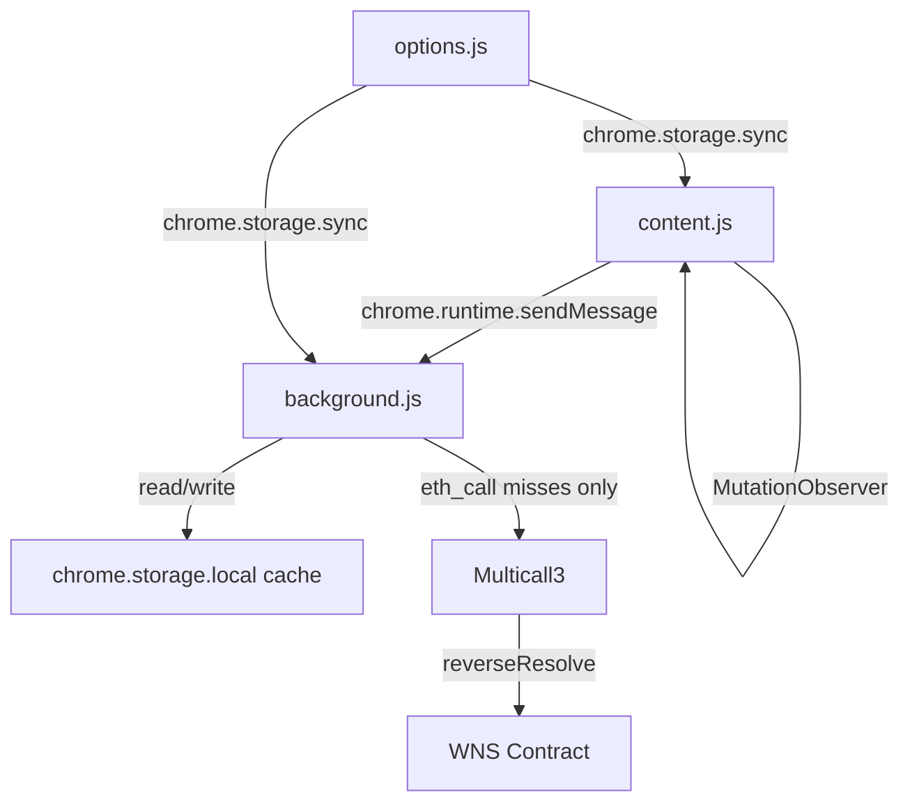
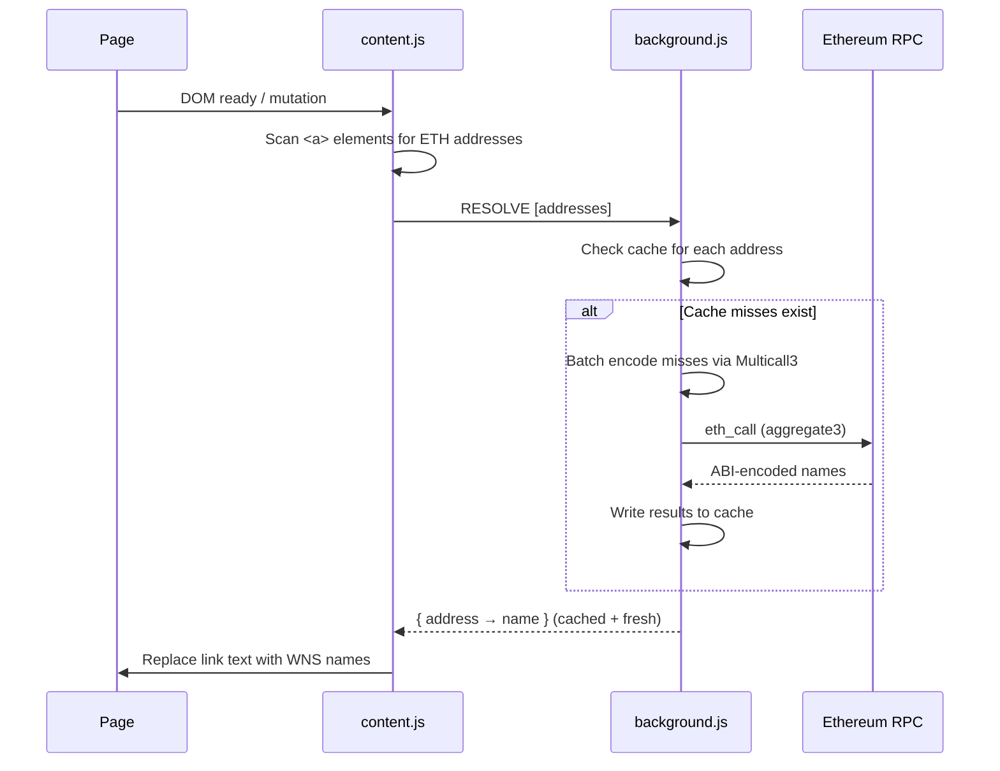

# Wei Name Service Resolver - Chrome Extension

Chrome Manifest V3 implementation of the Wei Name Service (WNS) Resolver Extension.

## Installation

### Development

1. Clone this repo
2. Open `chrome://extensions`
3. Enable **Developer mode**
4. Click **Load unpacked** and select the `chrome/` directory

*No build requirements — vanilla JS, zero dependencies.*

### Production

*Pending testing and feedback.*

## Architecture

*Entity Relationships*



*Resolution Sequence*



## Configuration

Set via the extension options page (right-click extension icon → Options).

### General

| Setting | Default | Description |
|:---|:---|:---|
| RPC URL | `https://eth.llamarpc.com` | Ethereum JSON-RPC endpoint. Calls are batched via Multicall3. |
| Request Headers | *(none)* | Custom HTTP headers sent with each RPC request (e.g. `Authorization`). Add key/value pairs via the UI. |
| Replace ENS Names | `false` | Also replace links whose display text ends with `.eth`. |
| Enable Console Logging | `false` | Enables debug output to the browser console with `[WNS]` (content script) and `[WNS bg]` (background) prefixes. |
| Enable Name Cache | `true` | Cache resolved names in `chrome.storage.local` to avoid redundant RPC calls. When enabled, only addresses not already in the cache (or whose cache entry has expired) trigger an RPC request. Negative results (addresses with no WNS name) are also cached. |
| Cache TTL (minutes) | `60` | How long cached name entries remain valid before being re-fetched. Accepts values from 1 to 10080 (7 days). |
| Clear Name Cache | — | Button that removes all cached name entries from local storage. Useful after a WNS name change to force immediate re-resolution. |
| Ignore List | *(empty)* | Display texts to ignore — one entry per line. Links whose visible text exactly matches an entry will not be replaced. |

### Advanced

These settings are hidden behind the **Advanced** toggle on the options page.

| Setting | Default | Description |
|:---|:---|:---|
| Custom Href Rules | *(empty)* | JSON array of rules for extracting an Ethereum address from a link's `href`. Each rule has a `"pattern"` (regex string) and an optional `"group"` (capture group number, defaults to `1`). Rules are tried in order; the first valid match wins. Takes priority over the default full-address pattern. |
| Full Address Pattern | `\b0x[0-9a-fA-F]{40}\b` | Regex applied to each link's `href` to find a full 40-hex-char Ethereum address. Used when no Custom Href Rule matches. |
| Abbreviated Display Text Pattern | `\b0x([0-9a-fA-F]{4,})[….]{2,3}([0-9a-fA-F]{4,})\b` | Regex to match a shortened address in a link's visible text (e.g. `0x1234…5678`). Must contain two capture groups: prefix hex digits and suffix hex digits. These are matched against full addresses found in the `href`. |

#### Custom Href Rules example

```json
[
  {
    "pattern": "[?&]a=(0x[0-9a-fA-F]{40})",
    "group": 1
  }
]
```
